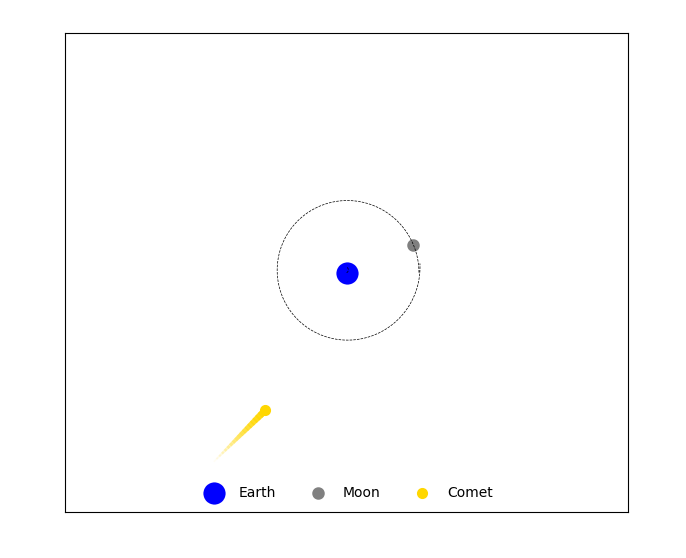

# Gravity

Python code that calculate and plot the moon's orbit by appling Gravitational Force equation, Newton's Second Law and kinetics equations. Code created to practice some concepts of python programing, like classes and plotting data.

